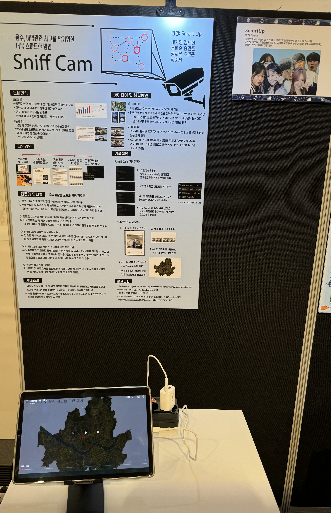

  <h2 id="about">About Me</h2>
  

    I am a Yonsei University undergraduate student majoring in Artificial Intelligence. My interests lie in Machine Learning, Backend, Cloud Computing, and Cybersecurity. Through various projects and activities, I have gained hands-on experience in developing AI services, including a Retrieval-Augmented Generation (RAG) chatbot, and computer vision applications. This experience has solidified my passion for the field, and I am eager to continue learning and tackling more complex challenges.
  

  <h2 id="education">Education</h2>
  <h3>Yonsei University (Mar. 2024 – Present)</h3>
  <ul>
    <li><strong>Degree:</strong> Undergraduate student of Artificial Intelligence</li>
    <li><strong>GPA:</strong> 3.86/4.50</li>
  </ul>

  <h2 id="projects">Projects</h2>
  
  

    

      <h3><a href="https://www.youtube.com/watch?v=1QyDu8JpnZA" target="_blank">Sniff Cam</a></h3>
      
This project is a computer vision-based system designed to proactively enhance public safety by automatically detecting individuals exhibiting abnormal walking patterns, such as those indicative of intoxication, from real-time CCTV footage.

      <ul>
        <li><strong>Objective:</strong> To develop a proof-of-concept for an automated surveillance tool that can identify potential risks by analyzing human movement.</li>
        <li><strong>Implementation:</strong> Utilized Python and OpenCV to process live video streams, extract key skeletal points, and trained a machine learning model to classify gait patterns.</li>
        <li><strong>Outcome:</strong> Successfully created a system capable of performing automated risk assessment by flagging unusual gait patterns.</li>
      </ul>
    

    

      
    

  

  

  

    

      <h3><a href="https://github.com/jiyunjung0/rag-chatbot" target="_blank">RAG Chat Bot</a></h3>
      
This project addresses the challenge of Large Language Model (LLM) "hallucinations" by creating a Q&A chatbot that provides answers grounded exclusively in a trusted, private knowledge base. The system is designed to be reliable and contextually precise.

      <ul>
        <li><strong>Architecture:</strong> Employed a Retrieval-Augmented Generation (RAG) model.</li>
        <li><strong>Implementation:</strong> Built a knowledge base using ChromaDB, retrieved relevant information with LangChain, and generated context-based responses to ensure accuracy.</li>
        <li><strong>Outcome:</strong> Engineered a highly accurate and trustworthy chatbot that avoids fabricating information by ensuring every response is verifiable against the source documents.</li>
      </ul>
    

  

  <h2 id="experiences">Experiences</h2>
  <h3>AX Coding Camp (Aug. 2025)</h3>
  <ul>
    <li>Learned advanced prompt engineering techniques and developed functional AI web services using the OpenAI API and Gradio.</li>
    <li>Worked on the "RAG Chat Bot" project.</li>
  </ul>
  <h3>Play-it Club (Sep. 2024 - Present)</h3>
  <ul>
    <li>As a committee member, organized club-wide gaming tournaments and community events.</li>
  </ul>
  <h3>YCC (Yonsei Computing Club) rookies Club (Mar. 2024 - Dec. 2024)</h3>
  <ul>
    <li>Participated in an algorithm-focused study group.</li>
    <li>Worked on the "Sniff Cam" project.</li>
  </ul>

  <h2 id="skills">Skills</h2>
  <ul>
    <li><strong>Languages:</strong> Python, C/C++, MATLAB</li>
  </ul>

  <h2 id="interests">Interests</h2>
  <ul>
    <li>
      <strong>Machine Learning:</strong> I am keenly interested in the fundamental challenges of <strong>Reinforcement Learning (RL)</strong>, particularly <strong>Model-Based RL (MBRL)</strong>, where I aim to investigate methods for <strong>improving Sample Efficiency</strong> and stability. My focus is on exploring how <strong>Foundation Models</strong> can be applied to complex visual tasks and how to enhance their <strong>robustness and generalization capabilities</strong> across diverse data environments.
    </li>
    <li>
      <strong>Backend:</strong> I am interested in investigating the design and optimization of <strong>High-Performance Distributed Systems</strong> to handle large-scale traffic. Specifically, I want to explore best practices for building <strong>Low-Latency</strong> backend architectures essential for <strong>real-time AI model serving</strong> and the implementation of efficient <strong>API Gateways</strong>.
    </li>
    <li>
      <strong>Cloud Computing (AI-Focused):</strong> My goal is to investigate methods for <strong>optimizing AI/ML Workloads</strong> within the cloud. I am interested in studying the effective use of <strong>Kubernetes (K8s) and MLOps</strong> practices for managing scalable training pipelines for large models, and exploring the architectural patterns of <strong>Serverless and Container Orchestration</strong> for cost-efficient, high-scalability inference services.
    </li>
    <li>
      <strong>Cybersecurity:</strong> I wish to investigate advanced defense mechanisms, focusing on <strong>AI-Powered Threat Detection</strong> using Machine Learning for building highly accurate Intrusion Detection Systems (IDS) and performing real-time <strong>Anomaly Detection</strong>. Furthermore, I am interested in analyzing common <strong>Web and Application Security</strong> vulnerabilities and researching robust authentication/authorization protocols for secure Backend API development.
    </li>
  </ul>

  <h2 id="hobbies">Hobby</h2>
  

    

      <ul>
        <li>Playing games, Photography, Cooking</li>
      </ul>
    

    

      
    

  

